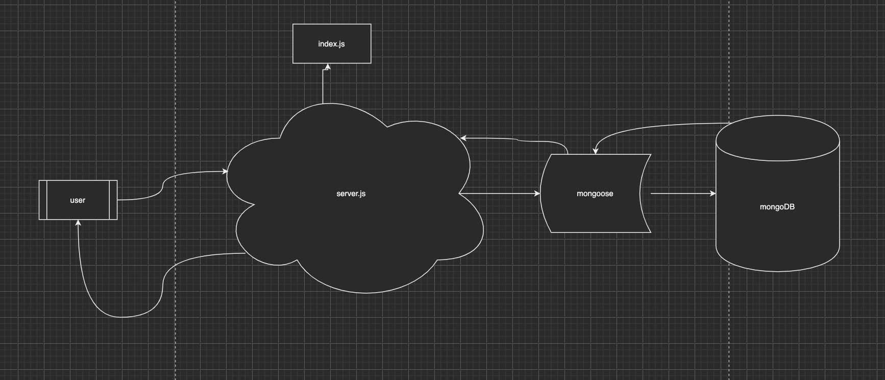

# LAB - Class 13
## Lab 13 - Bearer Authentication
### Author: Clayton Jones

### Links and Resources  

[submission PR](https://github.com/claytonjones-401n16/lab-10/pull/2)  
[GitHub Actions](https://github.com/claytonjones-401n16/lab-10/actions)  
[back-end URL](https://js-401n16-authentication.herokuapp.com/)  

### Setup  

#### .env requirements 

- `PORT`
- `MONGODB_URI`
  
#### How to initialize/run your application (where applicable)
`node index.js` OR
`nodemon`

#### Documentation   
To view API docs:
- use URL ``
  
#### Tests  

How do you run tests?
- `npm test`

#### UML  

